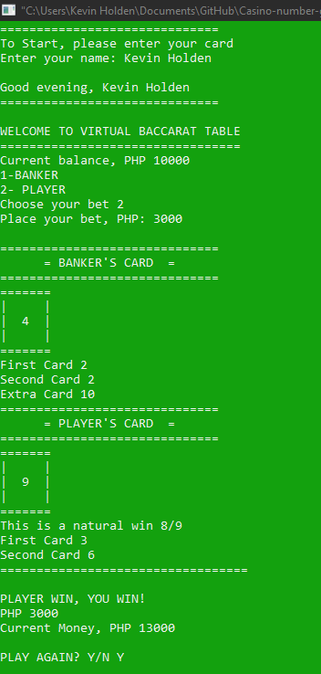

# Casino number guessing game

Player chooses between two sides either
'banker' or 'player'. After drawing two cards the one
who has the nearest number to 9 wins.

Whenever sum overboards to 9, 1 card will be drawn
from the deck. However if at the first two draw
results a sum of 8 and 9, the dealer won't draw
additional card anymore.

The application invites the user to enter a wager amount and then guess a number on rolling. He wins if the computed random number matches the user input; else, his money is reduced. The user can keep playing until he has spent all of his money.

